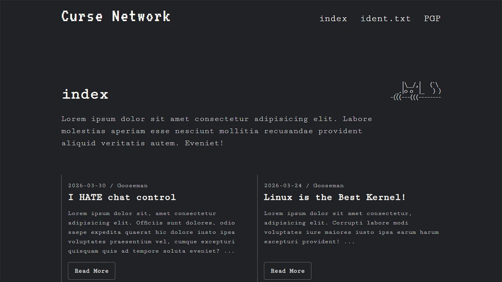

# No-Script Index

A simple blog-style(index) website built without JavaScript, focusing on semantic HTML, accessibility and clean CSS.

## Features

- Fully functional navigation without JavaScript
- Semantic HTML structure
- Responsive layout
- CSS-only hamburger menu
- Blog-style post previews
- Accessible markup and structure
- Basic RSS feed for content updates
- Open Graph and Twitter meta tags for link previews
- Basic SEO setup (meta tags, robots.txt)

## Tech

- HTML
- CSS

## Live Demo

[link](https://engstrom.design/demos/noscript-page/index.html)

## About the project

This project was built as an exploration of how much functionality can be achieven using only HTML and CSS.
The goal was to create a clean and usable interface without relying on JavaScript.

## What I worked on

- Structuring content using semantic HTML elements
- Creating a CSS-only navigation system using a checkbox toggle
- Designing a responsive layout
- Implementing accessible markup

## Key Learnings

- How to build interactive UI without JavaScript
- The importance of semantic HTML for structure and accessibility
- Working with CSS for layout and interaction
- Keeping code simple and maintainable

## Future Improvements

- Improve accessibility even more
- Design the other pages
- Improve SEO and metadata setup
- Enhance social sharing
- Expand on RSS
